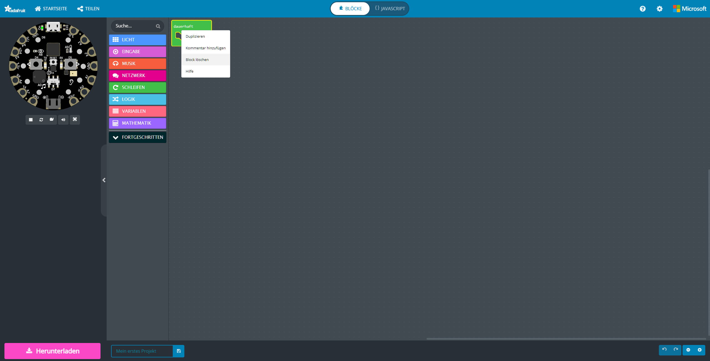
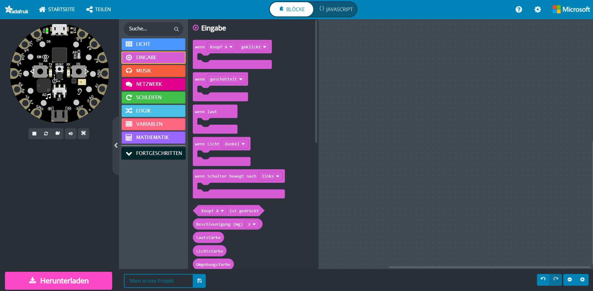
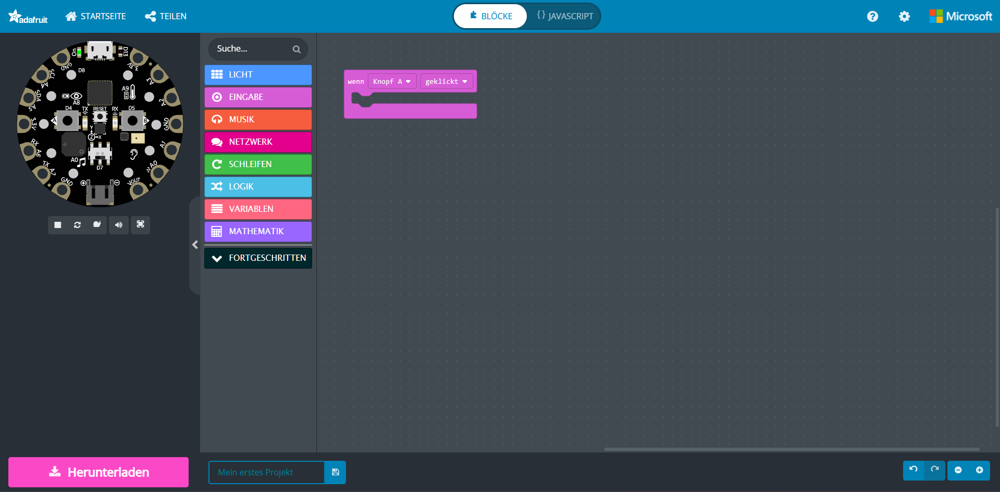
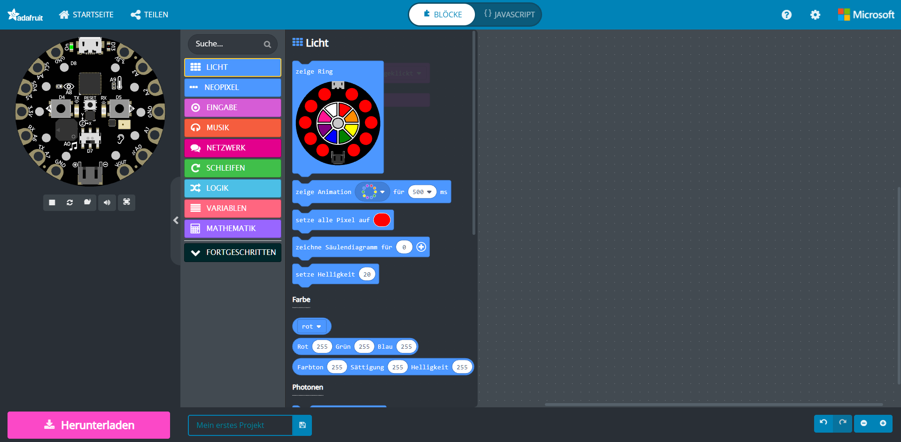
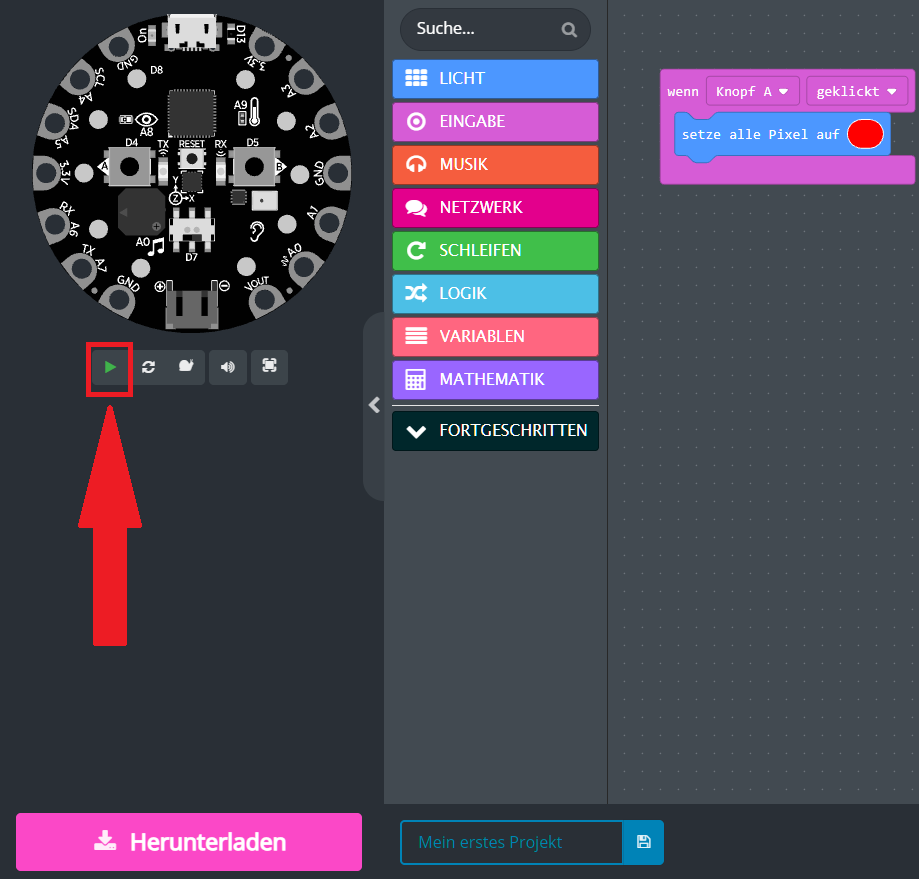
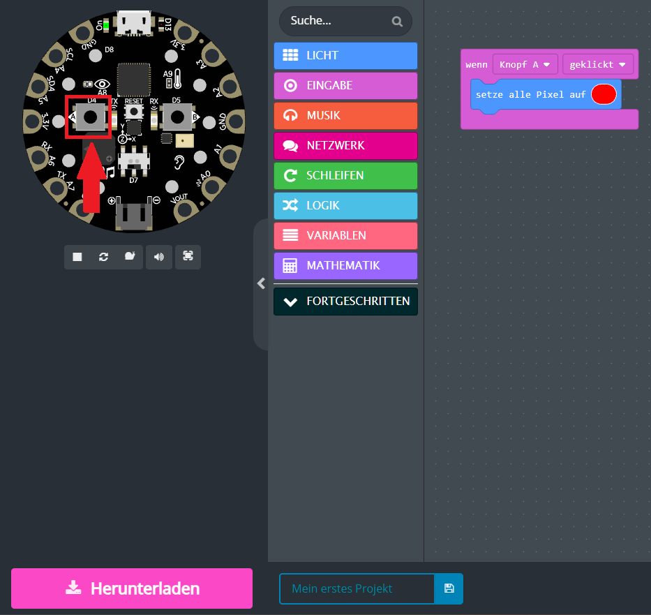
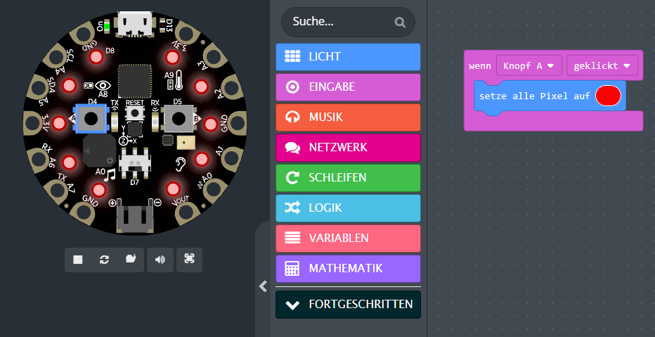
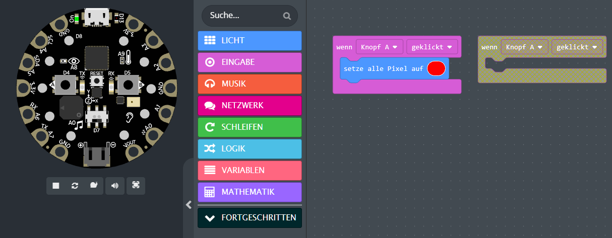
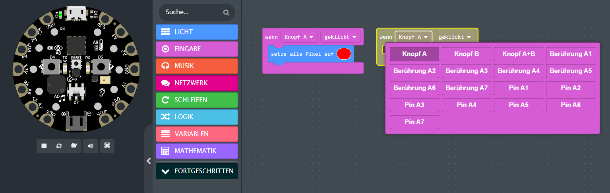

b# Mein erstes Programm

## Wie du dein erstes Programm für dein Playground Board erstellst

> **Voraussetzung** hier für ist, dass du bereits ein Projekt auf [makecode.adafruit.com](https://makecode.adafruit.com/#) offen hast. (Schritte von [#01](./01%20Mein%20erstes%20Projekt.pdf))

 

> **Ziel** hier ist, dass wir am Ende aus deinem Playground Board eine kleine Taschenlampe machen.

## Anleitung

1. Zu erst müssen wir unseren Arbeitsbereich aufräumen. Dazu machst du auf den grünen Block "dauerhaft" einen rechts-klick und klickst danach auf "Block löschen".

> **Überlegung**: Was benötigen wir für eine Taschenlampe?

    1. Schalter, um die Lampe anzumachen.
    2. LEDs / Lampen für das Licht.
    3. Schalter, um die Lampe wieder auszumachen.

2. Fangen wir damit an, die Lampe anzumachen. Hierfür benötigen wir die Eingabe eines Knopfes. Wie du vielleicht schon gemerkt hast hat das Playground Board zwei Knöpfe (Knopf A und Knopf B).
Um den Knöpfen eine Funktion zu geben benötigen wir einen Block aus der Kategorie "Eingabe". Klicke dazu auf "Eingabe" und schaue dir die Blöcke in diesem Menu an. Die Blöcke sind beschriftet und zeigen damit wie sie agieren.

3. Vielleicht ist dir beim Lesen auch schon aufgefallen, dass wir hier den ersten Block "wenn Knopf A geklickt" benötigen. Also ziehen wir diesen Block mit links-klick auf unsere Arbeitsfläche.

4. So weit so gut! Jedoch müssen wir jetzt unserem Knopf noch etwas zu tun geben. Wir wollen unsere Lichter anmachen. Folgend gehen wir in das "Licht" Menu. Hier suchen wir uns ein Block raus, welcher in unseren "Wenn Knopf A gedrückt" Block passt.

5. Wie dir vielleicht schon aufgefallen ist, passen hier mehrere Blöcke. Für unsere Taschenlampe brauchen aber lediglich den "setze alle Pixel auf (rot)" Block. Ziehe diesen Block wieder mit linksklick erst in die Arbeitsfläche und dann in den bereits existierenden Block. (So wie auf dem Bild unten)

 

> **Überlegung**: Was macht unser Programmcode bisher?
 
> Unser Code _sollte_ bisher auf Knopfdruck die LEDs anschalten.

## Benutzen wir den Simulator

1. Klicke auf das grüne Dreieck um den Simulator zu starten.

2. Klicke auf den linken Knopf (Knopf A) um die LEDs zu aktivieren.

3. Die Lampen sollten jetzt an sein. (Wenn nicht, überprüfen deine Code-Blöcke!)

 

> **Wunderbar!** Die Simulation und unser Code funktioniert. Jetzt müssen wir nur noch die Lichter deaktivieren.

6. Um die Lichter zu deaktivieren benutzen wir den zweiten (B) Knopf. Dazu benötigen wir wieder einen "Eingabe" Block, um genau zu sein den gleichen Block! Ziehe dir einen neuen "wenn Knopf A geklickt" Block auf die Arbeitsfläche.

7. Du kannst die meisten Blöcke konfigurieren, genau wie den neuen "wenn Knopf A geklickt" Block. Klicke hierzu auf "Knopf A".

8. Da wir den Knopf B benötigen, wähle diesen mit einem links-klick aus.

9. 